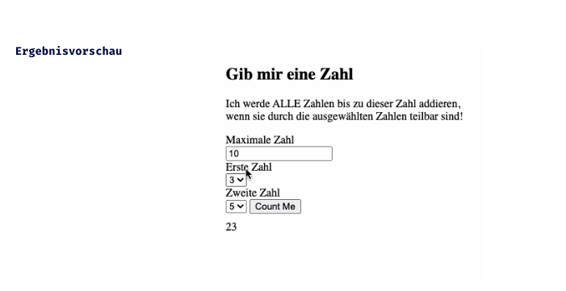

07 Vertiefung JavaScript – Loops

Eine Übung im SuperCode Bootcamp

## 🎓 Aufgabe

Aufgabenstellung

Das heutige Projekt sind Übungen zur Vertiefung zu JavaScript - Loops

## 💡 Assets

## 📸 Screenshots

## 💻 Running

Zur Seite —> - [Vertiefung JavaScript – Loops 2](https://jennijennina.github.io/Vertiefung-JavaScript-Loops2/)

<h3 align="left">Languages and Tools:</h3>

 
 
 

